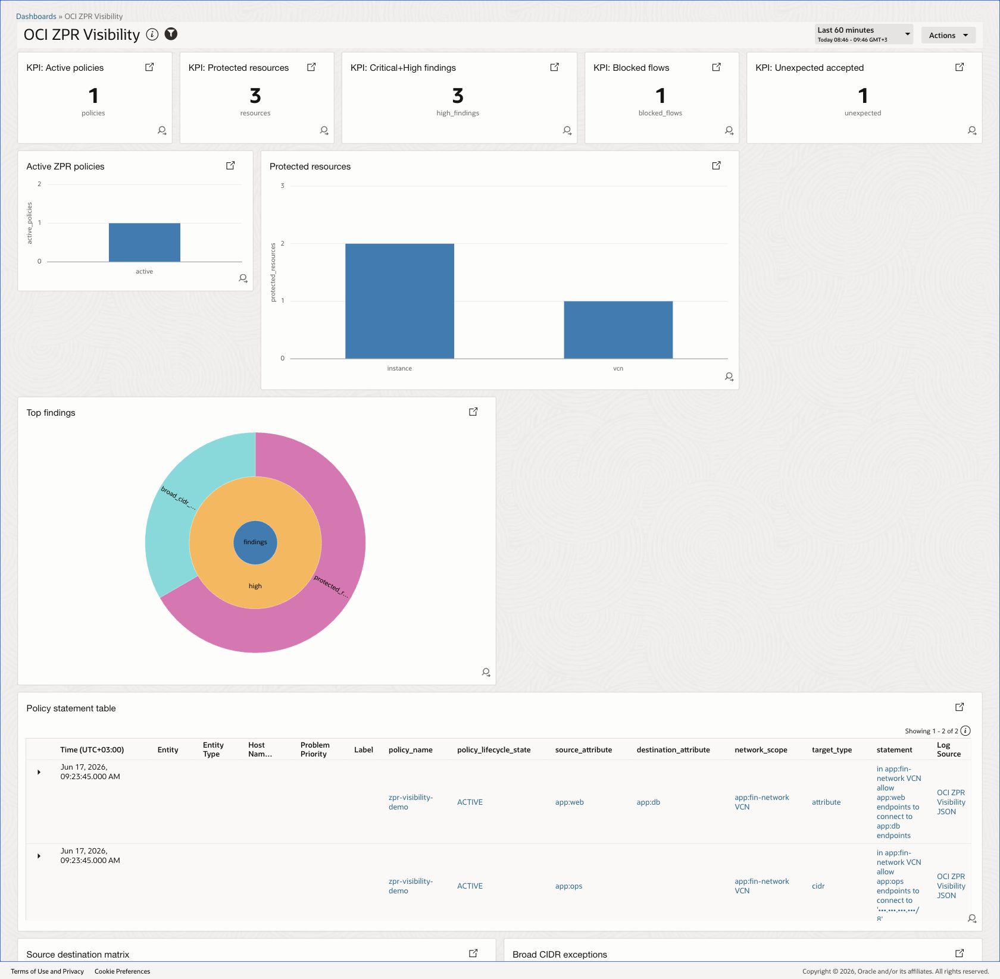
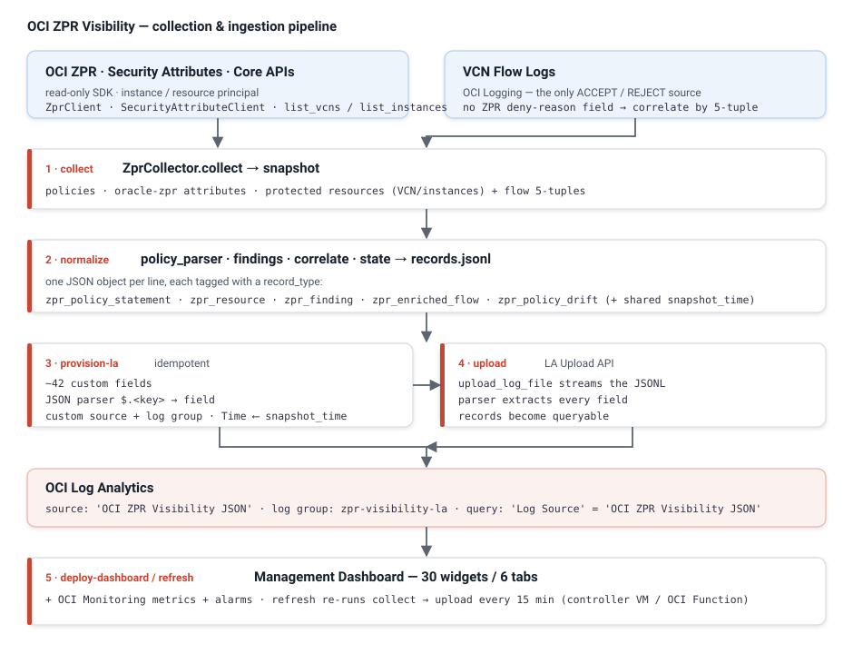
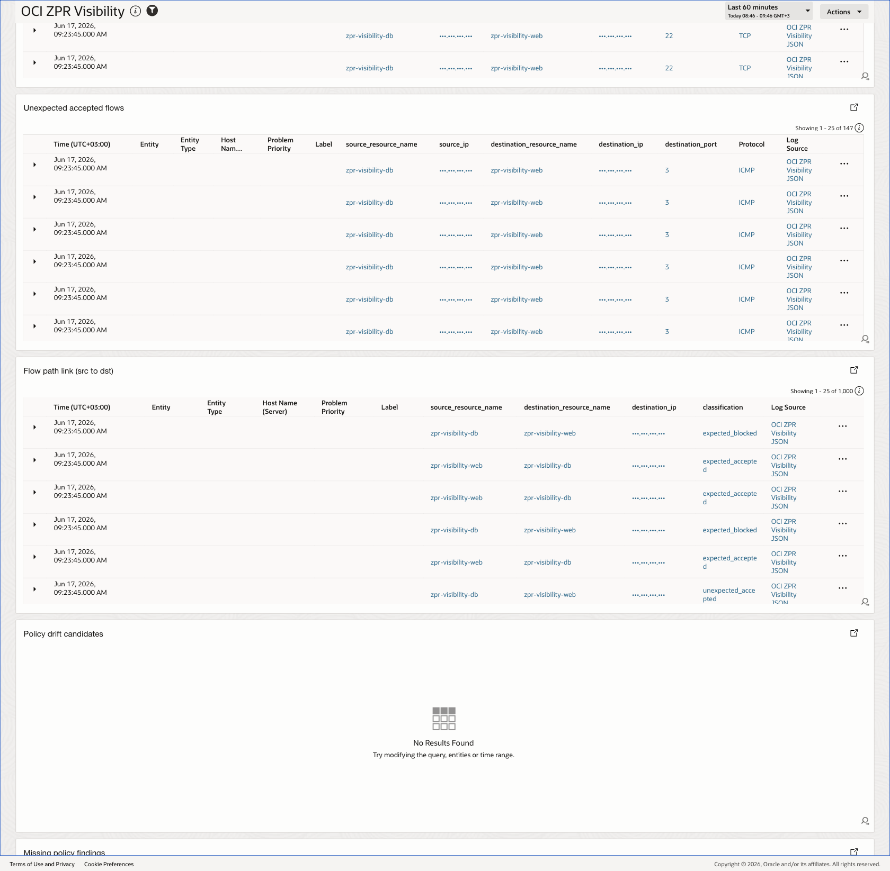
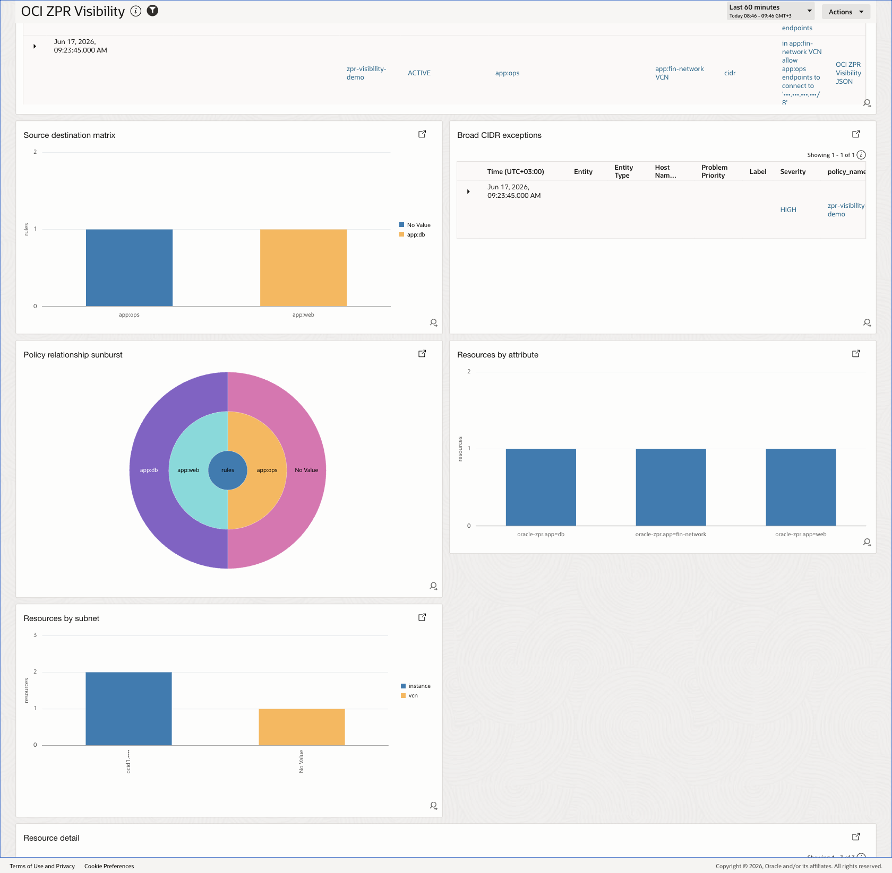
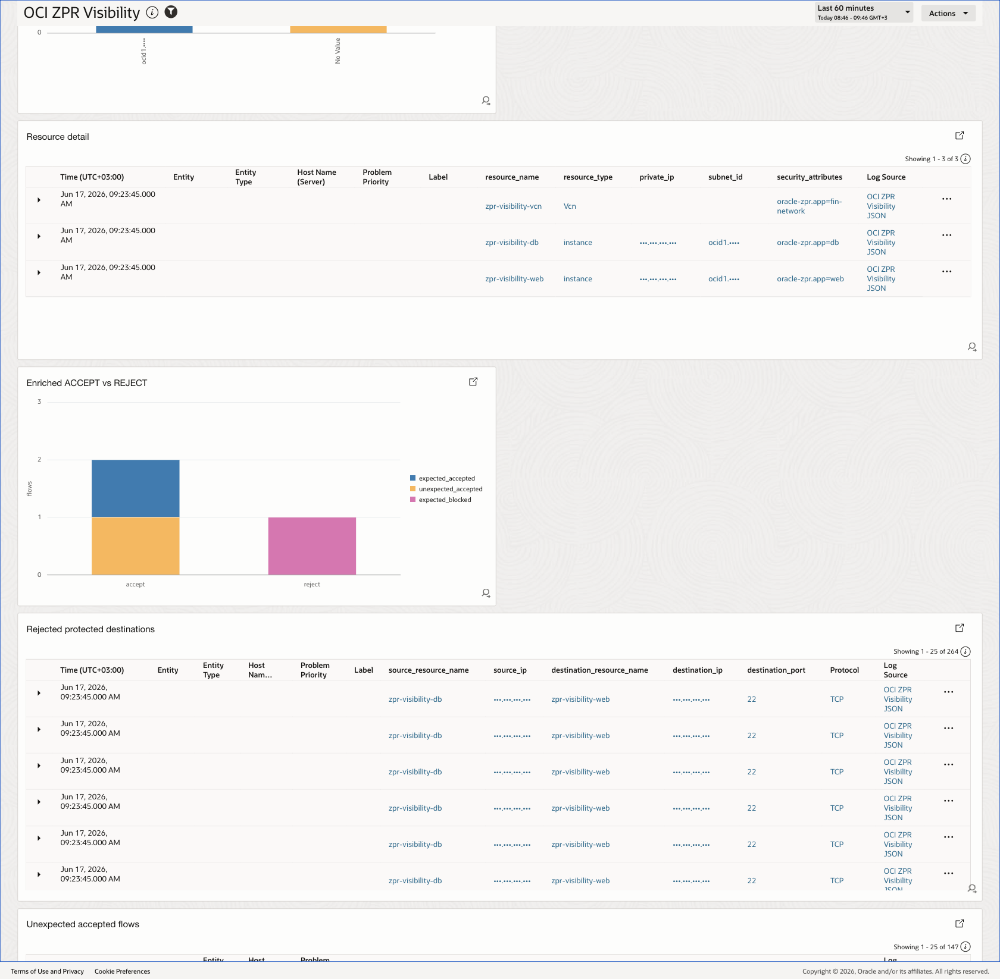
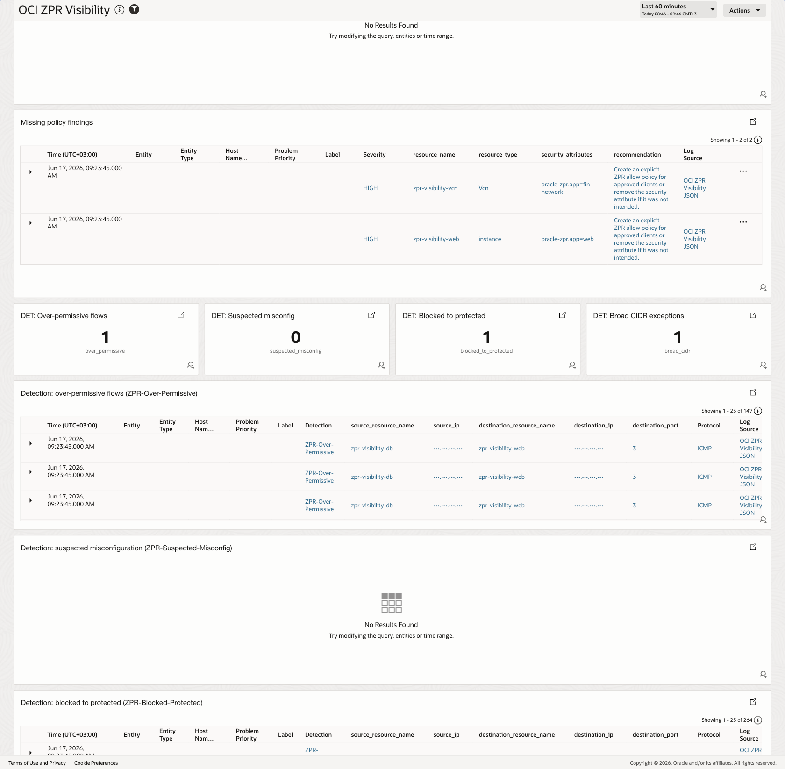
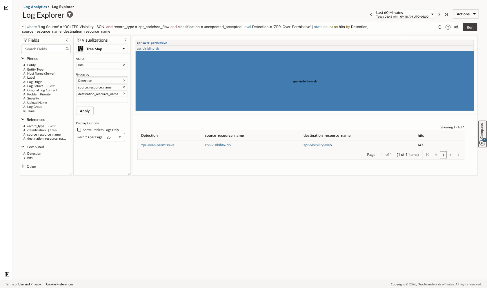
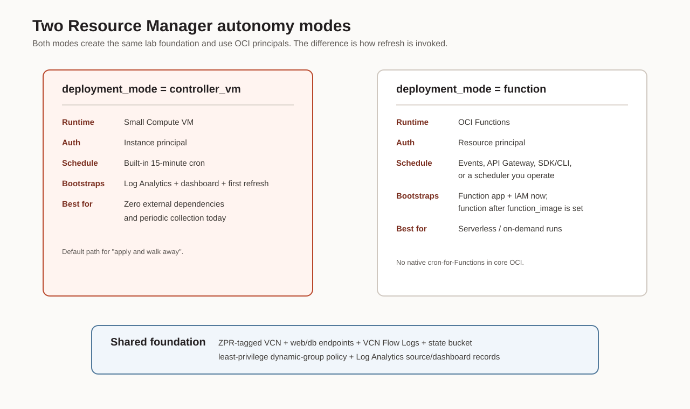

# OCI ZPR Visibility

[](https://cloud.oracle.com/resourcemanager/stacks/create?zipUrl=https://github.com/adibirzu/oci-zpr-visibility/raw/main/orm-stack.zip)

One click deploys the **full demo** (ZPR-tagged VCN, `web`/`db` endpoints, a ZPR
policy, VCN Flow Logs, Log Analytics source + dashboard, and a 15-minute refresh
loop) into your tenancy via Oracle Resource Manager. Already run ZPR? Skip the
demo and point this at your real setup — see
[**Use it on your existing ZPR setup**](docs/discovery.md).

> **Zero Trust Packet Routing (ZPR)** secures OCI networks by *security
> attributes* (labels like `app:web`, `app:db`) and human-readable intent
> (`in app:fin-network VCN allow app:web endpoints to connect to app:db
> endpoints`) instead of brittle, topology-based security lists and CIDRs.
> Policy follows the resource's attributes — not its IP — so network
> misconfiguration can't override security intent. ZPR *enforces* well but gives
> limited day-to-day **visibility** into posture, allow/block decisions vs
> intent, and policy drift. **This project closes that gap.** Full rationale:
> [docs/zpr-overview.md](docs/zpr-overview.md).

End-to-end starter implementation for OCI Zero Trust Packet Routing visibility:

* Works alongside tenancy-level ZPR (enable once via Terraform `oci_zpr_configuration` or the SDK; the stack assumes ZPR is already active and creates the demo policy).
* Enables OCI VCN Flow Logs into OCI Logging.
* Routes flow logs and custom ZPR inventory records to OCI Log Analytics through Connector Hub.
* Collects ZPR configuration, policies, security attributes, protected resources, and IP/resource mappings.
* Emits normalized policy, resource, finding, and enriched flow records.
* Provides a Log Analytics custom source and a 40-widget Management Dashboard suite across 7 focused views.



> *The Executive posture tab: active policies, protected resources, critical/high findings, blocked flows, and unexpected-accepted KPIs, with the policy statement table below. Live data from a demo tenancy; OCIDs and IPs are masked.*

Oracle’s current ZPR SDK exposes `ZprClient` methods including `create_configuration`, `get_configuration`, `list_zpr_policies`, and `get_zpr_policy`. The OCI Terraform provider exposes `oci_zpr_configuration` to onboard ZPR in the root compartment. VCN Flow Logs expose ACCEPT/REJECT network decisions and fields such as source/destination address, protocol, VNIC OCID, subnet OCID, and compartment OCID; they do not provide a dedicated ZPR deny-reason field, so this project uses explicit policy/resource correlation.

Primary Oracle references:

* [OCI Python SDK ZprClient](https://docs.oracle.com/en-us/iaas/tools/python/latest/api/zpr/client/oci.zpr.ZprClient.html)
* [Terraform oci_zpr_configuration](https://docs.oracle.com/en-us/iaas/tools/terraform-provider-oci/latest/docs/r/zpr_configuration.html)
* [VCN Flow Log details](https://docs.oracle.com/en-us/iaas/Content/Logging/Reference/details_for_vcn_flow_logs.htm)
* [Connector Hub Terraform resource](https://registry.terraform.io/providers/oracle/oci/latest/docs/resources/sch_service_connector)

## Documentation

| Doc | What it covers |
|-----|----------------|
| [docs/zpr-overview.md](docs/zpr-overview.md) | **What ZPR is and why it matters** — the case for attribute-based zero-trust routing |
| [docs/log-format.md](docs/log-format.md) | The ingested JSON record schema (5 record types + fields) and how to view it |
| [docs/detections.md](docs/detections.md) | ZPR detection rules (labels), conditions, and how to promote them to alerts |
| [docs/architecture.md](docs/architecture.md) | End-to-end design, ingestion paths, collector internals, detection logic, IAM |
| [docs/services.md](docs/services.md) | OCI service dependency graph + relationship table |
| [docs/api-cli-reference.md](docs/api-cli-reference.md) | OCI SDK operations, `oci` CLI commands, app CLI + scripts, Terraform resources |
| [docs/runbook.md](docs/runbook.md) | Operator flow: deploy, collect, validate, IAM policies |
| [docs/validation.md](docs/validation.md) | Live end-to-end validation evidence, including fresh-run and query-parse gates |
| [docs/orm-deployment.md](docs/orm-deployment.md) | One-click Oracle Resource Manager deployment (full lab + LA + dashboard) |
| [docs/discovery.md](docs/discovery.md) | **Use it on your existing ZPR setup** — discover, then stand up continuous collection |
| [docs/deployment-modes.md](docs/deployment-modes.md) | Run autonomously in OCI — controller VM vs OCI Function vs Management Agent |
| [ROADMAP.md](ROADMAP.md) | Long-term, phased enhancement plan |

## Architecture

### How logs are collected and sent to Log Analytics



1. **Collect** — read ZPR config/policies, the `oracle-zpr` security attributes,
   and protected resources (VCN/instances via Core APIs, since Resource Search
   omits `securityAttributes`); correlate VCN Flow Logs against policy intent.
2. **Normalize** — emit flat JSON records, one per line, each tagged with a
   `record_type` (`zpr_policy_statement` / `zpr_resource` / `zpr_finding` /
   `zpr_enriched_flow` / `zpr_policy_drift`) and a shared `snapshot_time`.
3. **Provision** — idempotently create ~42 LA custom fields, a JSON parser
   (`$.<key>` → field, `snapshot_time` → **Time**), the custom source
   **`OCI ZPR Visibility JSON`**, and the `zpr-visibility-la` log group.
4. **Upload** — stream the JSONL via the LA **Upload API**; LA parses it and the
   records are queryable as `'Log Source' = 'OCI ZPR Visibility JSON'`.
5. **Visualize** — `deploy-dashboard` imports the Management Dashboard; `refresh`
   re-runs the whole loop every 15 min and publishes Monitoring metrics.

Full design (component diagram, collector internals, detection model, IAM):
[docs/architecture.md](docs/architecture.md). Record schema:
[docs/log-format.md](docs/log-format.md). Detection rules:
[docs/detections.md](docs/detections.md).

## What the dashboard shows

The Management Dashboard ships as **40 widgets across 7 focused dashboards**:
executive posture, policy inventory, protected-resource coverage, flow review,
drift governance, detections, and collection health. Screenshots below are from
a live demo tenancy with identifiers and IPs masked.

**Allow / block traffic — real flows correlated against policy intent**



**Policy inventory — every ZPR statement decomposed (source/destination/scope/target), with broad-CIDR exceptions flagged**



**Protected resource map — what carries `oracle-zpr` attributes, and which resources have no governing policy**



**Detections — each violation class tagged with a `Detection` label, one step from an alert**



**Everything is just a query — run the same searches yourself in Log Explorer**



## Use it on your existing ZPR setup

Already running ZPR? Skip the demo lab. `discover` does a read-only survey of your
tenancy and prints the exact commands (with your flow-log OCIDs) to stand up the
same continuous collection:

```bash
oci-zpr-visibility discover --auth api_key --profile <profile> --region <region>
```

It reports ZPR enablement, policies, `oracle-zpr` attributes, protected
resources, and the VCN Flow Logs it found (tenancy root + compartment subtree),
then emits the `provision-la` → `refresh` → `deploy-dashboard` steps and how to
schedule them. Full guide: [docs/discovery.md](docs/discovery.md).

## Install

Use an isolated virtual environment so the project's `oci>=2.176.0` does not
collide with other tools (notably the OCI CLI, which pins its own SDK version):

```bash
python3 -m venv .venv
.venv/bin/pip install -e ".[dev]"
.venv/bin/oci-zpr-visibility --help
```

## Operational subcommands

Exposed via the main CLI (and as thin `scripts/*.py` shims for legacy paths):

| Subcommand | Purpose |
|------------|---------|
| `oci-zpr-visibility discover` | **Read-only** survey of an existing tenancy's ZPR (config, policies, attributes, protected resources, VCN Flow Logs) + the exact continuous-collection commands. |
| `oci-zpr-visibility seed` | Create the `app` security attribute + a real ZPR policy (the rule). |
| `oci-zpr-visibility trigger` | Generate flows exercising every detection classification (offline trigger; production uses VCN Flow Logs). |
| `oci-zpr-visibility provision-la` | Idempotently create LA custom fields, JSON parser, source, log group; `--upload` ingests records. |
| `oci-zpr-visibility validate-dashboards` | Execute all dashboard queries against live LA (HIT/MISS/ERROR). |
| `oci-zpr-visibility deploy-dashboard` | Build + import the OCI LA Management Dashboard (`--dry-run` to preview). |
| `oci-zpr-visibility refresh` | Scheduled unit: collect → drift → upload → publish metrics. |

For one-click provisioning of the whole lab + LA content + dashboard, use the
**Oracle Resource Manager** stack — see [docs/orm-deployment.md](docs/orm-deployment.md).

Three ways to run it autonomously inside OCI (no laptop in the loop) — controller VM,
OCI Function, or Management Agent host:



See [docs/api-cli-reference.md](docs/api-cli-reference.md) for the full surface
and [docs/validation.md](docs/validation.md) for the end-to-end validation run.

## Local demo

```bash
python -m oci_zpr_visibility.cli demo --output-dir out/demo
```

This uses `examples/sample_snapshot.json` and `examples/sample_flow_logs.jsonl` to produce:

* `out/demo/snapshot.json`
* `out/demo/records.jsonl`
* `out/demo/enriched_flows.jsonl`

## Deploy

```bash
cp terraform/terraform.tfvars.example terraform/terraform.tfvars
terraform -chdir=terraform init
terraform -chdir=terraform plan
terraform -chdir=terraform apply
```

Then emit inventory to the custom log:

```bash
python -m pip install -e .
oci-zpr-visibility collect \
  --profile DEFAULT \
  --region <REGION> \
  --emit-log-id <ZPR_INVENTORY_CUSTOM_LOG_OCID>
```

See [docs/runbook.md](docs/runbook.md) for the full operator flow.
